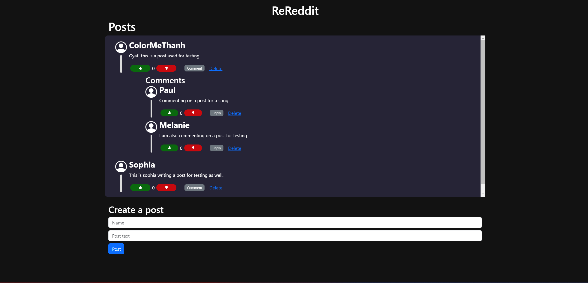
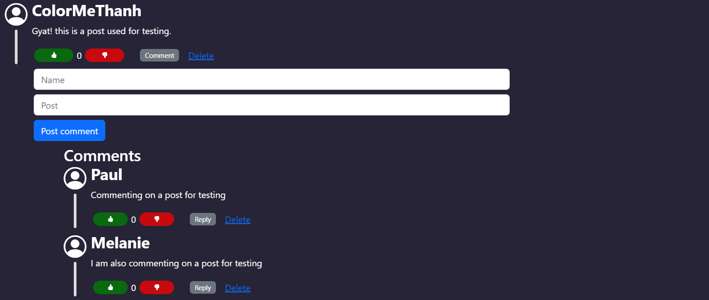
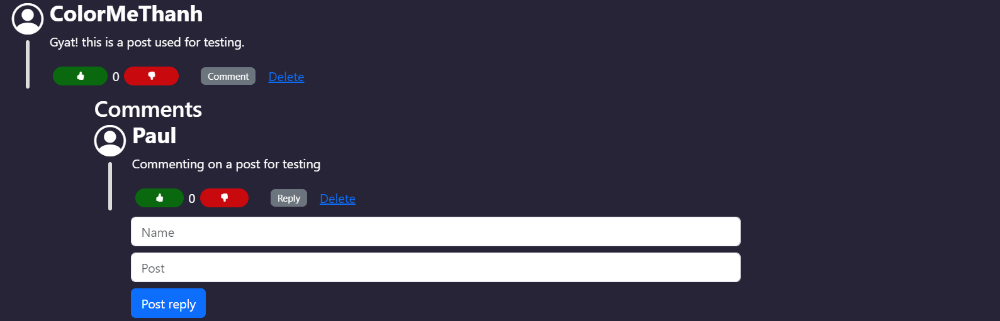

## Project Reddit

This project has been created by a student at Parsity, an online software engineering course. The work in this repository is wholly of the student based on a sample starter project that can be accessed by looking at the repository that this project forks.

If you have any questions about this project or the program in general, visit [parsity.io](https://parsity.io/) or email hello@parsity.io.

## What is it?

A rendition of the popular social media website "reddit".

### features include

- View posts and comments
  
- Comment on a posts
  
- Reply to a comment (will append the '@[commentAuthor]' to the message)
  
  
- Like/dislike Post (Like count will update on click)
- Delete post (with confirmation page on click of delete button)
- Delete comment (with confirmation page on click of delete button)

### files overview

- **index.html**: the main html page. The entrypoint of app.
- **main.js**: houses the html manipulating logic.
- **MyClasses.js**: houses the classes used for the app (SocialMedia, Post, Comment).
- **style.css**: custom styles used for the app.
- **SpecRunner.html**: entrypoint for testing suite (jasmine.js).
- **spec/ReRedditSpec.js**: houses the tests for app.

### technology used

- plain old JS
- Bootstrap v5
- Jquery
- uuidv4
- Jasmine

### how to run

- run the "index.html"

_A parsity project by Thanh_
